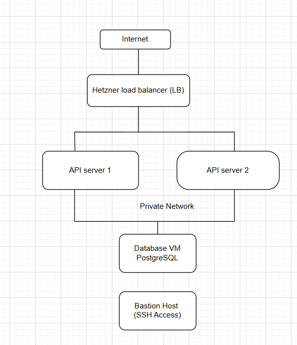

# DevOps Take-Home Challenge – Scalable Weather API Deployment

## 1. Overview

This repository contains a complete, production-ready DevOps solution for deploying a **Go-based Weather API** on **Hetzner Cloud**, using:

- **Terraform** for Infrastructure as Code (IaC)
- **Ansible** for configuration management
- **Docker** for containerization
- **GitHub Container Registry (GHCR)** for image hosting

The solution supports **two environments (dev & prod)**, high availability, security best practices, and clean teardown for cost control.

---

## 2. Architecture

### 2.1 High-Level Architecture
 
    
 

### 2.2 Design Decisions

- **Load Balancer** distributes traffic across API servers
- **Stateless API containers** enable horizontal scaling

- **Private networking** isolates internal communication
    - ❗ **IMPORTANT:** the solution is created with public ip for api & database VM, i have created another repository for create / deploy api & database in private network 
    https://github.com/prash-v-kumar/devops-challenge-with-private-network
    
- **Bastion host** ensures secure SSH access
- **Firewall rules** follow least-privilege principle
- **Terraform** is the single source of truth
- **Ansible** handles configuration and application deployment

## 3. Prerequisites

### 3.1 Local Machine Requirements

- Terraform >= 1.5
- Ansible >= 2.14
- Docker
- Python >= 3.9
- Git
- Generate ssh key pair for the environment and place it in directory ~/.ssh/
    
    example 
    ssh-keygen -t rsa -b 4096 -f ~/.ssh/prod-ssh-key -C "terraform-prod"

- hcloud cli 

### 3.2 Accounts Required

- Hetzner Cloud account
- GitHub account with GHCR access

---

## 4. Repository Structure

├── infrastructure/
│ ├── modules/
│ │ ├── network/
│ │ ├── bastion/
│ │ ├── api/
│ │ ├── database/
│ │ ├── loadbalancer/
│ │ └── firewall/
│ └── envs/
│   ├── dev/
│   └── prod/
│
├── ansible/
│ ├── inventories/
│ │ ├── dev/
│ │ └── prod/
│ ├── playbooks/
│ └── roles/
|
├── api/
|
└── architecture.png
└── README.md

---

## 5. Infrastructure Deployment (Terraform)

### 5.1 Configure Variables

Create a `terraform.tfvars` file inside `infrastructure/envs/dev`:

hcloud_token = "<HETZNER_API_TOKEN>"

ssh_public_key_path = "~/.ssh/dev-ssh-key.pub"

environment = "dev"

### 5.2 Initialize Terraform

cd infrastructure/envs/dev

terraform init

### 5.3 Plan Terraform

terraform plan -var="hcloud_token=$HCLOUD_TOKEN"

### 5.4 Deploy Terraform

terraform apply -var="hcloud_token=$HCLOUD_TOKEN"

Terraform creates:

- Private network and subnet

- Bastion host

- 2 API servers

- 1 Database server

- Load balancer

- Firewall rules

- SSH key configuration

### 5.5 Infrastructure verification

    verify the resources created using hcloud cli with token 
    useful commands 

    hcloud server list
    
    hcloud server describe <server id>
    
    hcloud loadbalancer list
    
    hcloud loadbalancer describe <load balancer name / id>
    
    hcloud firewall list

## 6. Docker Image & Registry
### 6.1 Build Docker Image

docker build -t ghcr.io/prash-v-kumar/weather-api:dev-1.0.0 .

### 6.2 Authenticate to GHCR

echo $GITHUB_TOKEN | docker login ghcr.io -u prash-v-kumar --password-stdin

### 6.3 Push Image

docker push ghcr.io/prash-v-kumar/weather-api:dev-1.0.0

## 7. Configuration Management (Ansible)
### 7.1 Generate Inventory from Terraform Outputs
terraform output -json > outputs.json

python scripts/generate-hosts.py --env dev

### 7.2 Run Ansible Playbooks from local machine
cd ansible

ansible-playbook -i inventories/dev/hosts.yml playbooks/site.yml --ask-vault-pass

ansible-playbook -i inventories/dev/hosts.yml playbooks/api.yml --ask-vault-pass

ansible-playbook -i inventories/dev/hosts.yml playbooks/db.yml --ask-vault-pass

### 7.3 Run Ansible Playbooks from pipeline
#### 7.3.1 Store ansible vault password as a github secret variable
    - Name: ANSIBLE_VAULT_PASSWORD
    - Value: <ansible-vault-password>

#### 7.3.2 Create vault password file at runtime

    echo "$ANSIBLE_VAULT_PASSWORD" > ~/.vault_pass
    chmod 600 ~/.vault_pass

#### 7.3.3 Create vault password file at runtime

   ❗**Important** replace <env> with according to the environment(dev, prod) which we are going to configure

    ansible-playbook \
    -i inventories/<env>/hosts.yml \
    playbooks/site.yml \
    --vault-password-file ~/.vault_pass

    ansible-playbook \
    -i inventories/<env>/hosts.yml \
    playbooks/api.yml \
    --vault-password-file ~/.vault_pass

    ansible-playbook \
    -i inventories/<env>/hosts.yml \
    playbooks/db.yml \
    --vault-password-file ~/.vault_pass

example:
    
    ansible-playbook \
    -i inventories/dev/hosts.yml \
    playbooks/site.yml \
    --vault-password-file ~/.vault_pass

#### 7.3.4 Cleanup from build system

  rm -f ~/.vault_pass

#### 7.3.5 Secrets Management

    - Secrets are stored using Ansible Vault

    - Vault file example: inventories/dev/group_vars/secret.yml

    Example:

    db_password: "********"

#### 7.3.6 Ansible configuration
    - Bastion host
    - Docker installation
    - Pulls API image from GHCR
    - API container deployment
    - PostgreSQL installation
    - Database and user creation
    - Ensures services start on boot

## 8. Verification
### 8.1 Health Check

    curl http://<LOAD_BALANCER_IP>/health

    Expected response:

    {"status":"ok"}

### 8.2 Weather API Endpoint

    curl http://<LOAD_BALANCER_IP>/weather

    Expected response:

    {"temperature":25.5,"humidity":60.5,"pressure":1013.25}

### 8.3 Metrics
    curl http://<LOAD_BALANCER_IP>/metrics

### 8.4 Container Status
    docker ps

## 9. Scale up/down
### 9.1 Scale API Servers

#### 9.1.1 Update Terraform variable:

    api_instance_count = 3

#### 9.1.2    Apply:

    terraform apply -var="hcloud_token=$HCLOUD_TOKEN"

    - New servers are automatically
    - Added to the load balancer
    - Configured via Ansible

## 10. Security measures

    - Database server can be reached from only from the subnet
    - API servers allow traffic only from LB
    - SSH access restricted to Bastion host
    - Firewall rules enforce least privileage   
    - Multiple API instances behind LB
    - Stateless API containers
    - ansible secrets are encrypted with ansible vault
    - Health checks on /health
    - Easy horizontal scaling

## 11. Reliablity considerations
    - Load balancer provides API high availability
    - Database
        - single instance (cost efficient for challenge)
        - In Production
            - Replication
            - backups
            - clustering / managed DB

## 12. Cost Awareness
    - Small Hetzner instance types (CX23)
    - Minimal infrastructure
    - No managed services
    - Easy teardown
## 13. Teardown
    to avoid unncessary costs, we can teardown the enviornment by using

     cd infrastructure/envs/dev
     terraform destroy -var="hcloud_token=$HCLOUD_TOKEN"

## 14. Assumptions & Design decisions
    - Database is single node (need to consider HA in future)
    - API is stateless
    - API & DB instances to be deployed in private network, Bastion in public  for maximum security
    - GHCR is chosen to avoid running private registry
    - Terraform is for single source of truth
    - Ansible is chosen for separation of infra & configuration

## 15. Estimated cost

        Resource            | Monthly cost (Aprroximate)
        -------------------------------------
        Bastion             | 3.49 euro
        API servers 2       | 7 euro
        DB server           | 3.49 euro
        Load balancer       | 5.39 euro
                    total   | **~19.37 euro

Thank you for reviewing this submission.

